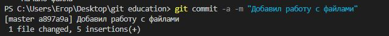
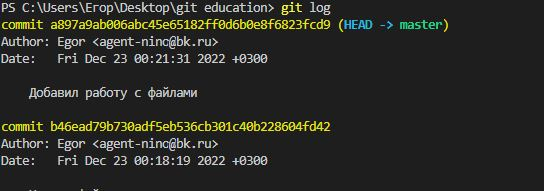
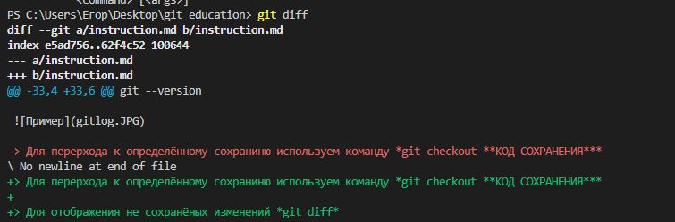

# Инструкция использования GIT
## Начало

Ещё не скаали программу? Не проблема, [нажми на меня](https://git-scm.com/download/win) и выбери свою **ОС**

**Пhоверка версии Git** 

git --version 

**Представимся GIT'у**

*git config --global user.email "***ВАША ПОЧТА***"*

*git config --global user.name "***Egor***"*

## Иницилизация GIT

1. Выбираем папку в которой бедем использовать Git
2. Пишем поманду *git init*
3. Создадим файл и добавим ему контроль версии при помощи команды *git add **ИМЯ_ФАЙЛА с расширением***

## Работа с файлом
>Для сохрания изменений пишем *git commi -a -m "*Комментарий*"*

>Для проверки состояния используем команду *git status*

>Для отображения всех версий сохранений есть команда *git log*

> Для перерхода к определённому сохраниню используем команду *git checkout **КОД СОХРАНЕНИЯ***

> Для отображения не сохранёных изменений *git diff*

## Создание ветвлений

* Для создания веток используем команду *git branch **НАЗВАНИЕ НОВОЙ ВЕТКИ***

А тут я в ветке мастер